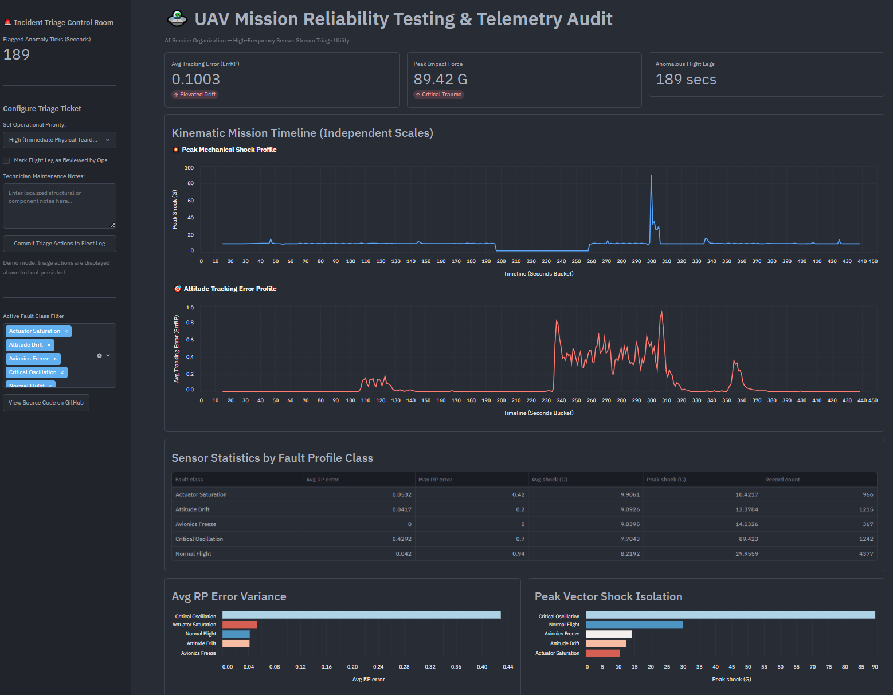

# UAV Mission Reliability Testing & Telemetry Audit Automation

**Author:** Davin Kim  
**Core Infrastructure:** DuckDB (SQL) · Python (pandas) · Conda · PowerShell  
**Frontend Stack:** Streamlit (Operations UI) · HTML5/CSS3/JS (GitHub Pages Executive Briefing)  
**Data Source:** [TLM-UAV Anomaly Detection Datasets — Kaggle](https://www.kaggle.com/datasets/luyucwnu/tlmuav-anomaly-detection-datasets/data)

---

## Dashboard Preview



---

## Why clean dashboards fail rugged robots

Most data analytics portfolios are built for the cloud, tracking clean consumer transactions, e-commerce clicks, or predictable SaaS metrics.

Physical robots don't live in the cloud. When an autonomous platform operates at the edge in unstructured, GPS-denied environments, a sensor failure isn't a database anomaly; it can take the vehicle offline mid-operation. If a drone or quadruped experiences thrust degradation, localized stabilization collapse, or structural impact mid-mission, a field operations team can't spend hours parsing a sub-second, multi-sensor fused telemetry log with hundreds of variables.

This project builds a local data pipeline that ingests 12,253 rows of high-frequency kinematic telemetry (`fusion_data_raw.csv`), isolates physical failure modes through time-series feature engineering, downsamples edge noise into human-scale windows, and produces an interactive triage dashboard that ops teams can use during incident review.

---

## Local execution architecture

This system runs entirely locally, bypassing cloud warehouses. That matters when edge-collected data carries operational constraints or simply doesn't belong on a third-party platform.

- DuckDB runs an embedded, vectorized execution engine in-memory inside a local Python process, handling complex analytical queries on raw CSV data at native C++ speed.
- A Conda environment (`uav-env`) on Windows 10 manages dependencies without affecting system-level packages.
- Streamlit reads directly from the engineered data layer, using `@st.cache_data` to avoid redundant disk I/O during UI interactions.

---

## Technical findings & kinematic insights

The telemetry audit identified **189 anomalous seconds** across the active flight timeline, mapping four distinct fault signatures from sensor variance and vector limits:

### Flight leg failure signatures

- **Label 1 (Attitude Drift):** Minor tracking deviations where actual orientation drifted slightly from commanded paths (`avg_rp_error: 0.0417`). These are normal closed-loop adjustments under localized loads like crosswinds, not failure states.
- **Label 2 (Critical Oscillation & Structural Shock):** Major hardware instability. Autopilot tracking errors jumped roughly 10x ($0.4292$), with a peak mechanical shock vector of **89.42 Gs**. That combination points to a severe structural impact or aerodynamic control loop breakdown.
- **Label 3 (Actuator Saturation):** Localized component strain. Tracking errors increased slightly ($0.0532$) while peak mechanical shock was the lowest across all fault categories ($10.42$ Gs). This pattern isolates a motor working at maximum thermal output to hold the platform airborne without causing immediate structural damage.
- **Label 4 (Avionics Freeze / Dead State):** A software lockup. Autopilot tracking errors dropped to exactly **0.0000**. A moving aerial vehicle navigating 3D space never achieves perfect zero error against its target; this reading means the flight controller froze and locked its last known state.

### Data pipeline & temporal integrity

- **Duplicate frames detected:** The pipeline caught a minimum time step of `0.0 ms`, confirming the hardware logger recorded duplicate sensor frames at identical millisecond marks.
- **Workshop gap isolated:** The temporal audit found a maximum consecutive time gap of **8,149,655.5 ms (~2.26 hours)**, corresponding to a non-flight bench period. A sanitization filter of `delta_ms < 500,000` removes this gap before any downstream visualization.

---

## Feature engineering & SQL optimizations

### Vector magnitude optimization (kinetic shock)

Computing the 3D Euclidean vector magnitude ($\|v\| = \sqrt{x^2 + y^2 + z^2}$) row-by-row across 12,253 records is slow when `SQRT` runs on every entry. The pipeline instead computes the squared magnitude ($x^2 + y^2 + z^2$) inside a Common Table Expression first. Because squaring preserves relative ordering ($A > B \iff A^2 > B^2$), the database finds the maximum squared value at full speed and applies `SQRT` only once per grouped category.

### Dual independent axis scale design

Standard single-axis charts break down when plotted variables differ by orders of magnitude. Peak mechanical shock reaches **89.42 Gs**; tracking errors range between `0.0` and `0.43`. On a shared axis, the error line flattens to an unreadable baseline.

The operations interface stacks these into two vertically aligned panels with independent vertical scales. This makes the correlation visible: the structural trauma spike and the tracking error explosion occur at the same millisecond.

---

## User interfaces and deployment

The frontend targets two different users with separate tools.

### Operations tool (Streamlit)

An interactive triage utility for support and dispatch teams working an active maintenance ticket. The sidebar shows a real-time anomaly count that updates with each filter change, a priority selector (High, Medium, Low), a reviewed checkbox, and a technician notes field. A fault class filter lets operators isolate specific failure modes, trimming the dataset to the windows they actually need to review.

The main panel has three KPI tiles (average ErrRP, peak impact force, anomalous flight leg count), a kinematic timeline with independent vertical scales for kinetic shock and attitude tracking error stacked in two panels, a sensor statistics table grouped by fault class, and bar charts comparing average RP error and peak shock across fault categories.

The app groups tracking data into 1-second buckets before rendering any visualization. Tracking error uses the bucket mean to surface sustained drift. Peak shock uses the bucket max so no impact event gets averaged away.

### Executive summary (GitHub Pages)

The HTML file is an executive briefing, not a second dashboard. It documents the full data lineage from raw ingestion to validated output: 12,253 raw ticks in, 4,086 duplicates and bench-period frames removed, 8,167 validated records out.

The 1-second downsampling runs in Streamlit, not here. That separation is the point. The static layer locks in absolute raw counts that don't change when you filter or interact with the UI. The 189 anomalous seconds operators see in Streamlit come from downsampling those 3,790 anomalous raw ticks. The HTML gives you the source number, so anyone auditing the pipeline can check the math without running anything.

The briefing covers four sections. The overview tab shows a pipeline throughput flow, four KPI tiles, and a fault distribution table with exact record counts for all five operational states. The mission timeline tab renders a Chart.js dual-axis chart of peak kinetic shock and attitude tracking error across the full flight, with annotated windows per fault mode. The fault analysis tab has one card per fault class with record counts, average ErrRP, peak shock, and a physical interpretation of what the sensor signature means. The pipeline audit tab shows the actual DuckDB SQL for the temporal sanitization, the feature engineering formula for the 3D shock vector, and a benchmark: end-to-end execution in under 1 ms on 12,253 records.

---

## Quickstart

Run these commands in PowerShell:

```powershell
# 1. Clone the repository
git clone https://github.com/DavinAnalytics/uav-telemetry-audit-pipeline.git
cd uav-telemetry-audit-pipeline

# 2. Set up the Conda environment
conda create -n uav-env python=3.11 -y
conda activate uav-env

# 3. Install core dependencies
pip install -r requirements.txt

# 4. Run the data pipeline to generate sanitized output
python build_telemetry_rules.py

# 5. Launch the triage dashboard
streamlit run app.py
```
